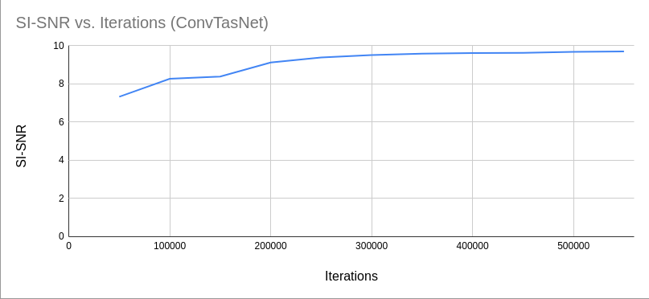

# VOICE SEPARATION 
Paper: [Improving Voice Separation by Incorporating End-To-End Speech Recognition](https://ieeexplore.ieee.org/document/9053845)

# Downloading the dataset

Install the packages axel, youtube-dl, parallel by using the following commands - 

	apt-get install axel, youtube-dl, parallel

Install the requirements.txt file by

	pip install -r requirements.txt

Download the csv files containing youtube-id of the video

[Train CSV](https://storage.cloud.google.com/avspeech-files/avspeech_train.csv)  
[Test CSV](https://storage.cloud.google.com/avspeech-files/avspeech_test.csv)

Run the shell script getDataset.sh present in preprocessing as 

	cd preprocessing
	njobs=<num-parallel-download-threads> numdownload=<num-files-to-download> ./getDataset.sh <path-to-csv-file> <output-directory-mp3> <output-directory-wav>

For example - 

	njobs=20 numdownload=1000000 ./getDataset.sh avspeech_test.csv test_mp3 test_wav
	njobs=20 numdownload=1000000 ./getDataset.sh avspeech_train.csv train_mp3 train_wav

Since you may not want to download the entire dataset, you can set the number of audio files you want to download using the numdownload argument.

## ConvTasNet Training

Inside the ConvTasNet directory, set the config.py variables

	Set config.dataSetPath['train'] -> Absolute path of where your train_wav folder is present
	Set config.dataSetPath['test'] -> Absolute path of where your test_wav folder is present
	Set config.basePath -> '<Path-To-Store-Experiment-Data>/'+str(datetime.now())

Training:

	cd ConvTasNet
	python main.py train

Testing:

	cd ConvTasNet
	python main.py test --modelpath "Path to trained model"

## ASR

Inside the directory ETESpeechRecognition, set the config.py variables

	Set config.path_to_download -> Absolute path of where you want to download the LibriSpeech dataset
	Set config.base_model_path -> Absolute path of where you want to save the trained model
	Set config.cache_dir -> Absolute path of where you want to save the unigram model, etc

Download the dataset

	cd ETESpeechRecognition
	python downloadDataSet.py

Pre-process

	python main.py genunigram
	
Training:

	python main.py train
	
Testing:

	python main.py test

	

## Oracle Training

Coming Soon

## Iterative Training

Coming Soon

## Trained Model

[ConvTasNet_Model](https://drive.google.com/file/d/1GrLlGq6XRirCS0MXH0JXqSRyY5G2nYNo/view?usp=sharing)

## Results

### Automatic Speech Recognition

|    CER    | CTC Loss | Attention Loss | Avg Loss |
|-----------|----------|----------------|----------|
|   0.5668  |  78.1625 |    49.1855     |  57.8786 |

### Speech Separation

|    Method   |    SI-SNR   |
| ----------- | ----------- |
| ConvTasNet  |     9.699   |
|   Oracle    |     TBD     |
|  Iterative  |     TBD     |

## Plots

## Credits

For downloading the AVSpeech dataset, the code was modified to download only mp3 with some additional features from the repository, https://github.com/changil/avspeech-downloader.

For training the ASR, the code was modified from the repository, https://github.com/mayank-git-hub/ETE-Speech-Recognition.
